# WebTracker - International Logistics Tracking Platform

<div align="center">

**A modern, full-stack shipment tracking system with WhatsApp integration and AI-powered manifest parsing**

[](https://nextjs.org/)
[](https://golang.org/)
[](https://www.postgresql.org/)
[](https://www.typescriptlang.org/)

[Features](#-features) • [Architecture](#-architecture) • [Getting Started](#-getting-started) • [Deployment](#-deployment) • [API Reference](#-api-reference)

</div>

---

## 📋 Overview

**WebTracker** is a comprehensive international logistics tracking platform designed for modern shipping operations. It combines a beautiful Next.js web interface with a powerful Go-based WhatsApp bot to provide real-time shipment tracking, automated notifications, and AI-powered manifest processing.

### Key Highlights

- 🌍 **Multi-Country Support** - Track shipments across international borders with country-specific delivery time calculations
- 📱 **WhatsApp Integration** - Automated bot for manifest submission and real-time shipment updates
- 🤖 **AI-Powered Parsing** - Google Gemini AI extracts shipment details from natural language messages
- 🗺️ **Interactive Maps** - Real-time shipment visualization with Leaflet.js
- 🔐 **Secure Admin Portal** - NextAuth-powered authentication with comprehensive shipment management
- 🌓 **Dark Mode** - Beautiful cosmic-themed UI with light/dark mode support
- 🌐 **Internationalization** - Full support for English and Portuguese
- ⚡ **Real-time Updates** - Automated status transitions and WhatsApp notifications

---

## 🏗️ Architecture



```mermaid
graph TB
    subgraph "Client Layer"
        A[Web Browser]
        B[WhatsApp Client]
    end

    subgraph "Frontend - Next.js 16"
        C[Next.js App Router]
        D[React Components]
        E[Server Actions]
        F[API Routes]
        G[NextAuth Middleware]
    end

    subgraph "Backend Services"
        H[Go WhatsApp Bot]
        I[Cron Jobs]
        J[Google Gemini AI]
    end

    subgraph "Data Layer"
        K[(PostgreSQL/Supabase)]
        L[Prisma ORM]
    end

    subgraph "External Services"
        M[Meta WhatsApp API]
        N[Google Gemini API]
        O[Cron-job.org]
    end

    A -->|HTTPS| C
    B -->|WhatsApp Messages| M
    M -->|Webhook| H
    
    C --> D
    C --> E
    C --> F
    C --> G
    
    D -->|Client Actions| E
    E -->|Database Queries| L
    F -->|API Calls| L
    
    H -->|Parse Manifest| J
    H -->|Store Shipment| K
    H -->|Send Reply| M
    
    I -->|Status Updates| K
    I -->|Send Notifications| M
    
    O -->|Trigger| F
    F -->|Process Queue| I
    
    L -->|Read/Write| K
    
    G -->|Auth Check| E
    G -->|Auth Check| F

    style A fill:#4A90E2
    style B fill:#25D366
    style C fill:#000000
    style H fill:#00ADD8
    style K fill:#336791
    style J fill:#4285F4
```

### Component Breakdown

#### **Frontend (Next.js)**

- **Framework**: Next.js 16 with App Router and React Server Components
- **Styling**: Tailwind CSS 4 with custom cosmic theme
- **Authentication**: NextAuth v4 with credentials provider
- **State Management**: React hooks and server actions
- **Maps**: Leaflet.js with React-Leaflet for interactive shipment visualization
- **Animations**: Framer Motion for smooth transitions and loading states
- **Internationalization**: Custom i18n implementation for English/Portuguese

#### **Backend (Go)**

- **WhatsApp Bot**: Built with `whatsmeow` library for Meta WhatsApp Business API
- **Database**: PostgreSQL connection via `pgx/v5` driver
- **Logging**: Structured logging with `zerolog` and log rotation via `lumberjack`
- **Scheduling**: Cron jobs with `robfig/cron` for automated tasks
- **AI Integration**: Google Gemini API for manifest parsing

#### **Database (PostgreSQL/Supabase)**

- **ORM**: Prisma for type-safe database access
- **Models**: Shipment, Event, NotificationQueue
- **Features**: Connection pooling, direct connections, migrations

---

## ✨ Features

### 🌐 Public Tracking Interface

- **Tracking Number Search** - Real-time shipment status lookup
- **Interactive Map** - Visual representation of shipment journey from origin to destination
- **Status Timeline** - Detailed event history with timestamps and locations
- **Delivery Time Calculation** - Precise ETA based on shipping windows and time zones
- **Responsive Design** - Mobile-first approach with beautiful UI
- **Multi-language** - English and Portuguese support

### 🔐 Admin Portal

- **Dashboard** - Overview of active shipments and statistics
- **Shipment Management** - Create, edit, delete, and archive shipments
- **Bulk Operations** - Delete delivered shipments, archive old records
- **Search & Filter** - Find shipments by tracking number, receiver, or status
- **Manual Status Updates** - Add events and update shipment status
- **AI Manifest Parser** - Upload or paste manifest text for automatic parsing

### 📱 WhatsApp Bot Features

- **Automated Manifest Processing** - Messages starting with `!INFO` or `#INFO` are parsed
- **Duplicate Detection** - Prevents duplicate shipments based on receiver phone
- **Real-time Replies** - Instant feedback with tracking number or error messages
- **Group Filtering** - Optional restriction to specific WhatsApp groups
- **Status Notifications** - Automated updates when shipments reach destination country
- **Retry Queue** - Failed notifications are queued and retried automatically

### 🤖 AI-Powered Features

- **Natural Language Parsing** - Extract shipment details from unstructured text
- **Manifest Validation** - Automatic validation of required fields
- **Error Handling** - Intelligent error messages for missing or invalid data

### ⚙️ Automation

- **Hourly Status Checks** - Automatic transition to "Arrived" when shipments reach destination
- **Notification Queue Processing** - Retry failed WhatsApp notifications every 5 minutes
- **Scheduled Cleanup** - Archive old shipments automatically

---

## 🚀 Getting Started

### Prerequisites

- **Node.js** 20+ and npm
- **Go** 1.25+
- **PostgreSQL** database (Supabase recommended)
- **WhatsApp Business Account** with Meta API access
- **Google Gemini API** key

### Frontend Setup

1. **Navigate to frontend directory**

   ```bash
   cd front
   ```

2. **Install dependencies**

   ```bash
   npm install
   ```

3. **Configure environment variables**

   ```bash
   cp .env.example .env
   ```

   Edit `.env` with your credentials:

   ```env
   # Database
   DATABASE_URL="postgresql://..."
   DIRECT_URL="postgresql://..."
   
   # Authentication
   NEXTAUTH_SECRET="your-secret-here"
   NEXTAUTH_URL="http://localhost:3000"
   ADMIN_USERNAME="admin"
   ADMIN_PASSWORD="your-password"
   ADMIN_EMAIL="admin@yourdomain.com"
   
   # AI
   GEMINI_API_KEY="your-gemini-api-key"
   ADMIN_TIMEZONE="Africa/Lagos"
   
   # Public Contact Info
   NEXT_PUBLIC_CONTACT_EMAIL="support@yourlogistics.com"
   NEXT_PUBLIC_CONTACT_PHONE="+1 (555) 000-0000"
   NEXT_PUBLIC_CONTACT_HQ="Global Logistics Center"
   ```

4. **Set up database**

   ```bash
   npx prisma generate
   npx prisma db push
   ```

5. **Run development server**

   ```bash
   npm run dev
   ```

   Open [http://localhost:3000](http://localhost:3000)

### Backend (WhatsApp Bot) Setup

1. **Navigate to backend directory**

   ```bash
   cd backend
   ```

2. **Install Go dependencies**

   ```bash
   go mod download
   ```

3. **Configure environment variables**

   ```bash
   cp .env.example .env
   ```

   Edit `.env` with your credentials:

   ```env
   # Database
   DATABASE_URL="postgresql://..."
   
   # WhatsApp
   WHATSAPP_PHONE_NUMBER="+1234567890"
   WHATSAPP_GROUP_ID=""  # Optional: restrict to specific group
   
   # Supabase (for direct HTTP API calls)
   SUPABASE_URL="https://your-project.supabase.co"
   SUPABASE_ANON_KEY="your-anon-key"
   ```

4. **Build the bot**

   ```bash
   go build -o bot.exe ./cmd/bot
   ```

5. **Run the bot**

   ```bash
   ./bot.exe
   ```

   On first run, scan the QR code with WhatsApp to authenticate.

### Cron Job Setup

Set up automated tasks on [cron-job.org](https://cron-job.org):

1. **Status Transition Job** (Hourly)
   - URL: `https://yourdomain.com/api/cron/check-transitions`
   - Schedule: `0 * * * *` (every hour)
   - Purpose: Update shipments that have arrived at destination

2. **Notification Queue Job** (Every 5 minutes)
   - URL: `https://yourdomain.com/api/cron/process-notifications`
   - Schedule: `*/5 * * * *`
   - Purpose: Retry failed WhatsApp notifications

---

## 📦 Deployment

### Frontend (Vercel - Recommended)

1. **Push to GitHub**

   ```bash
   git push origin main
   ```

2. **Import to Vercel**
   - Connect your GitHub repository
   - Set root directory to `front`
   - Add all environment variables from `.env`
   - Deploy

3. **Configure custom domain** (optional)

### Backend (VPS/Cloud Server)

1. **Build for production**

   ```bash
   GOOS=linux GOARCH=amd64 go build -o bot ./cmd/bot
   ```

2. **Upload to server**

   ```bash
   scp bot user@yourserver:/opt/webtracker/
   scp .env user@yourserver:/opt/webtracker/
   ```

3. **Set up as systemd service**

   ```ini
   [Unit]
   Description=WebTracker WhatsApp Bot
   After=network.target

   [Service]
   Type=simple
   User=webtracker
   WorkingDirectory=/opt/webtracker
   ExecStart=/opt/webtracker/bot
   Restart=always
   RestartSec=10

   [Install]
   WantedBy=multi-user.target
   ```

4. **Start the service**

   ```bash
   sudo systemctl enable webtracker-bot
   sudo systemctl start webtracker-bot
   ```

### Database (Supabase)

1. Create a new Supabase project
2. Copy connection strings (pooled and direct)
3. Run Prisma migrations:

   ```bash
   npx prisma db push
   ```

---

## 🔌 API Reference

### Public Endpoints

#### `GET /api/tracking/:trackingNumber`

Get shipment details by tracking number.

**Response:**

```json
{
  "trackingNumber": "TRK-ABC123",
  "status": "In Transit",
  "senderCountry": "Nigeria",
  "receiverCountry": "Portugal",
  "receiverName": "John Doe",
  "events": [
    {
      "status": "Picked Up",
      "location": "Lagos, Nigeria",
      "timestamp": "2026-01-15T10:00:00Z"
    }
  ]
}
```

### Admin Endpoints (Protected)

#### `POST /api/admin/shipments`

Create a new shipment.

**Request:**

```json
{
  "receiverName": "John Doe",
  "receiverPhone": "+351912345678",
  "receiverCountry": "Portugal",
  "senderCountry": "Nigeria"
}
```

#### `DELETE /api/admin/shipments/:id`

Delete a shipment by ID.

### Cron Endpoints

#### `GET /api/cron/check-transitions`

Check and update shipment statuses (triggered hourly).

#### `GET /api/cron/process-notifications`

Process notification retry queue (triggered every 5 minutes).

### Server Actions

#### `createShipment(formData)`

Create shipment from admin form.

#### `deleteShipment(shipmentId)`

Delete a shipment.

#### `bulkDeleteDelivered()`

Delete all delivered shipments.

#### `getTracking(trackingNumber)`

Get shipment by tracking number.

---

## 🗂️ Project Structure

```
webTracker/
├── front/                      # Next.js Frontend
│   ├── src/
│   │   ├── app/               # App Router pages
│   │   │   ├── actions/       # Server actions
│   │   │   ├── admin/         # Admin portal
│   │   │   ├── api/           # API routes
│   │   │   ├── auth/          # Authentication
│   │   │   └── page.tsx       # Home/tracking page
│   │   ├── components/        # React components
│   │   ├── lib/               # Utilities and constants
│   │   ├── services/          # Business logic
│   │   └── types/             # TypeScript types
│   ├── prisma/
│   │   └── schema.prisma      # Database schema
│   └── public/                # Static assets
│
└── backend/                    # Go WhatsApp Bot
    ├── cmd/
    │   └── bot/               # Main entry point
    ├── internal/
    │   ├── commands/          # Bot command handlers
    │   ├── config/            # Configuration
    │   ├── logger/            # Logging setup
    │   ├── models/            # Data models
    │   ├── parser/            # Manifest parser
    │   ├── scheduler/         # Cron jobs
    │   ├── supabase/          # Database client
    │   ├── whatsapp/          # WhatsApp client
    │   └── worker/            # Background workers
    └── go.mod                 # Go dependencies
```

---

## 🛠️ Tech Stack

### Frontend

- **Framework**: Next.js 16 (React 19)
- **Language**: TypeScript 5
- **Styling**: Tailwind CSS 4
- **Database ORM**: Prisma 5
- **Authentication**: NextAuth 4
- **Maps**: Leaflet.js + React-Leaflet
- **Animations**: Framer Motion
- **Icons**: Lucide React
- **Validation**: Zod
- **Testing**: Vitest + React Testing Library

### Backend

- **Language**: Go 1.25
- **WhatsApp**: whatsmeow
- **Database**: pgx/v5 (PostgreSQL driver)
- **Logging**: zerolog + lumberjack
- **Scheduling**: robfig/cron
- **UUID**: google/uuid

### Infrastructure

- **Database**: PostgreSQL (Supabase)
- **Hosting**: Vercel (Frontend), VPS (Backend)
- **Cron Jobs**: cron-job.org
- **AI**: Google Gemini API
- **Version Control**: Git + GitHub

---

## 📝 Environment Variables

### Frontend (.env)

| Variable | Description | Required |
|----------|-------------|----------|
| `DATABASE_URL` | PostgreSQL connection string (pooled) | ✅ |
| `DIRECT_URL` | PostgreSQL direct connection | ✅ |
| `NEXTAUTH_SECRET` | NextAuth encryption secret | ✅ |
| `NEXTAUTH_URL` | Application URL | ✅ |
| `ADMIN_USERNAME` | Admin login username | ✅ |
| `ADMIN_PASSWORD` | Admin login password | ✅ |
| `ADMIN_EMAIL` | Admin email address | ✅ |
| `GEMINI_API_KEY` | Google Gemini API key | ✅ |
| `ADMIN_TIMEZONE` | Admin timezone (e.g., Africa/Lagos) | ✅ |
| `NEXT_PUBLIC_CONTACT_EMAIL` | Public contact email | ❌ |
| `NEXT_PUBLIC_CONTACT_PHONE` | Public contact phone | ❌ |
| `NEXT_PUBLIC_CONTACT_HQ` | Company headquarters location | ❌ |

### Backend (.env)

| Variable | Description | Required |
|----------|-------------|----------|
| `DATABASE_URL` | PostgreSQL connection string | ✅ |
| `WHATSAPP_PHONE_NUMBER` | Bot's WhatsApp number | ✅ |
| `WHATSAPP_GROUP_ID` | Restrict to specific group (optional) | ❌ |
| `SUPABASE_URL` | Supabase project URL | ✅ |
| `SUPABASE_ANON_KEY` | Supabase anonymous key | ✅ |

---

## 🤝 Contributing

Contributions are welcome! Please follow these steps:

1. Fork the repository
2. Create a feature branch (`git checkout -b feature/amazing-feature`)
3. Commit your changes (`git commit -m 'Add amazing feature'`)
4. Push to the branch (`git push origin feature/amazing-feature`)
5. Open a Pull Request

---

## 📄 License

This project is proprietary software. All rights reserved.

---

## 🙏 Acknowledgments

- **Next.js Team** - For the amazing React framework
- **Vercel** - For seamless deployment
- **Supabase** - For PostgreSQL hosting
- **Meta** - For WhatsApp Business API
- **Google** - For Gemini AI API
- **Open Source Community** - For the incredible libraries and tools

---

## 📞 Support

For support, email `support@yourlogistics.com` or join our WhatsApp group.

---

<div align="center">

**Built with ❤️ by NexGenCodes**

[Website](https://yourlogistics.com) • [Documentation](https://docs.yourlogistics.com) • [Support](mailto:support@yourlogistics.com)

</div>
